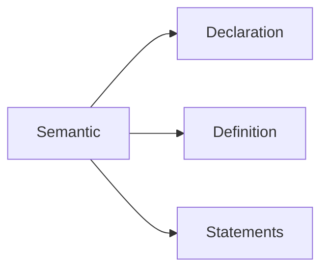
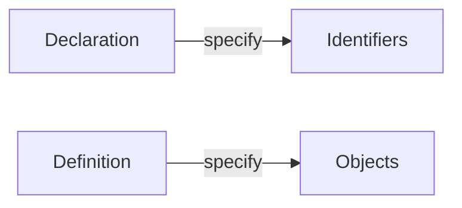

# Modern-C

## Level-1

- Syntax and semantics





- Object must have one definition
- Statements: instructions to tell what to do
- pointer: box sotres memory address of something
- `const name`: name becomes "immutable"

| Call by value                              | Call by reference                      |
|--------------------------------------------|----------------------------------------|
| functions cannot change value of arguments | functions can change argument's values |

| Signed int                                            | Unsigned int                                               |
|-------------------------------------------------------|------------------------------------------------------------|
| Contain negative integer (e.g. 0000 ~ 1111 => -8 ~ 7) | Contain only positive integer (e.g. 0000 ~ 1111 => 0 ~ 15) |

- Unsigned arithmetic has valid results except results overflow

### Pointers

- Address and type
  - address: location in memory
  - type: how this data is interpreted

- syntax

```c
// declaration
*identifierP
// let a pointer point to variable x
identifierP = &x;
// *A is a object which A points to
y = *identifier // y = x
```
