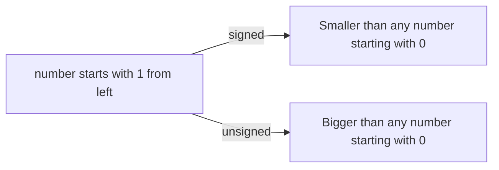

# computer architecture 10-17

- If I-type is used for load instructions, immediate (12-bits) would be used to represent offset (=> base +-$2^{11}$)
	- Max immediate: 12-bits
- reg: means register from 0 to 31
- address: constant (used in lw or sw)
- two principles:
	1. Instructions are represented as numbers.
	2. Programs are stored in memory to be read or written, just like data.

*32-bit and 64-bit processors: types of processors tell us how much memory a processor can access from a register*

# computer architecture 10-18

- `lui`: load upper immediate (load the upper 20 bits)
	- Be careful when the lower 12-bits are negative number because upper 20 bits constant should  be + 1
- `slli`: shift left logical immediate (or srli)

| logical shift | Arithmetic shift                    |
|---------------|-------------------------------------|
| Fills with 0s | preserves the sign (sign extension) |
(sra: shift right arithmetic (fill with a sign bit))

## Instructions for Making Decisions

- Conditional instructions
	- if statement: always test opposite case (e.g if s == j becomse if s != j)
- unconditional branch: processor always executes this instruction because condition is always true
	- e.g.) `beq x0, x0, Exit` : x0 always represents 0

- To get to the next element in the array, we need to skip 8 bytes (32-bits system)
- Example:
    - If i = 0, we want element at base address (offset = 0)
    - If i = 1, we want element at base address + 4 bytes
    - If i = 2, we want element at base address + 8 bytes
- a **basic block**: 
	- instructions without branches, except at the end
	- without branch targets or branch labels, except at the beginning

- An unsigned comparison of _x<y_ checks if _x_ is negative as well as if _x_ is less than _y_
- i.e.) No matter x is positive or negative, unsigned comparison x < y can check if x is out of bounds from an array
- x10–x17: eight parameter registers in which to pass parameters or return values
- x1: one return address register
- Procedure instruction (`jal` instruction):
	- branch to the address
	- save the address of the following instruction to `rd`
- program counter (pc): 
	- The register containing the address of the instruction in the program being executed
	- (execution instruction address register)

