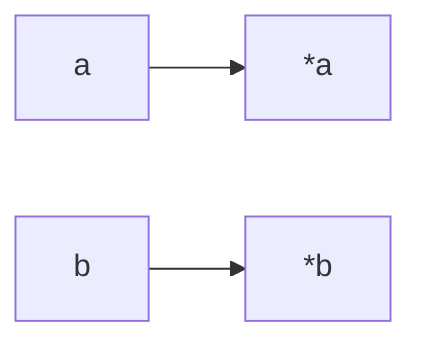

- A function divides parameters a by b. The result of this division is stored in the int pointed by a. The remainder of the division is stored in the int pointed by b.

```c
void ft_ultimate_div_mod(int *a, int *b)
{
    int div = *a / *b;
    int mod = *a % *b;

    *a = div;
    *b = mod;
}
```

