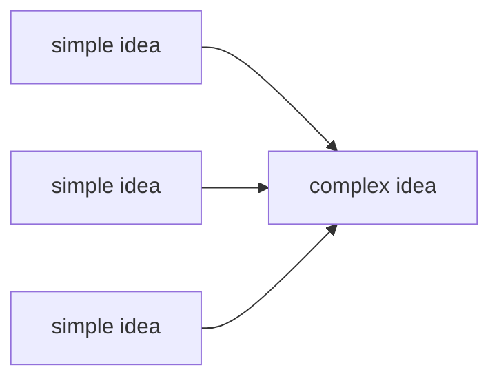
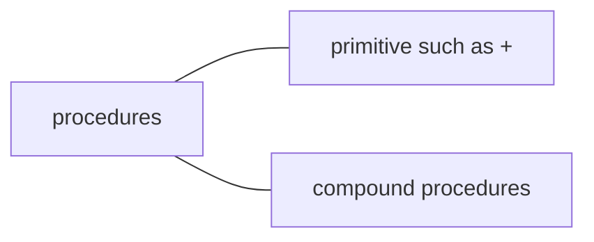
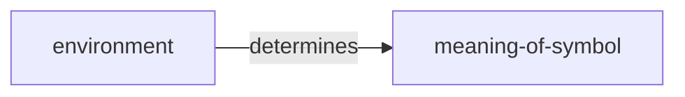

# Aim

 - To understand how program works,
 - So be versatile to any programming language

# When to finish
By 9/1


# 1.1 Elements of programming language

### Key Ideas



 1. primitive expressions
 2. means of combination
 3. means of abstraction

The most basic elements of programming language is 'data' and 'procedure'.



### Combination
combination = procedure 
How interpreter evaluates combination?

 - evaluate subexpressions of combination
 - apply operators to the arguments that are resulting values of subexpressions

次に各数値などのprimitive expressionを評価する。
実はoperatorも変数の特殊系みたいなものだと言える。
### Variable
Variable is one of abstraction ways.
It enables us to write more complex programs.
変数を使うために、memoryのどこかに記録しておく。
その場所を'global environment'という。

```scheme
(define size 2)
```

つまり複雑な問題も分解すれば、簡単になる。

### Procedure definitions
手順の複合体に名前をつけること。関数的なイメージ。

```scheme
(define (<name> <parameter>) (<body>))
```

### Applicative-order evaluaion and Normal-order evaluation

How interpreter recognizes your program?

| applicative | normal |
| --- | --- |
| the arguments to procedure are evaluated before the procedure is applied| the arguments to a procedure aren't evaluated until the values needed|


### Conditional
```scheme
(cond (<p1> <e1>)
	  (<p2> <e2>)
	  ...
	  (<pn> <en>))
```
p: predicate. (T or F)
e: subsequent expression

and, or = non procedures. なぜなら式の評価途中で処理が中止され、全ての引数が見られることがないかもしれないから。
not = procedures

> if  is a special form and not a procedure

In applicative-order evaluation, cond evaluates all arguments before the procedure. 
However, If firstly checks predicate and only evaluate the one side resulting expression (argument).

### mathematical functions vs computer procedures

| math-function | procedure |
|--|--|
| 物事の特性 | 物事の実行方法 |
| 宣言的知識 | 命令的知識 |
| what is  | how to    |

