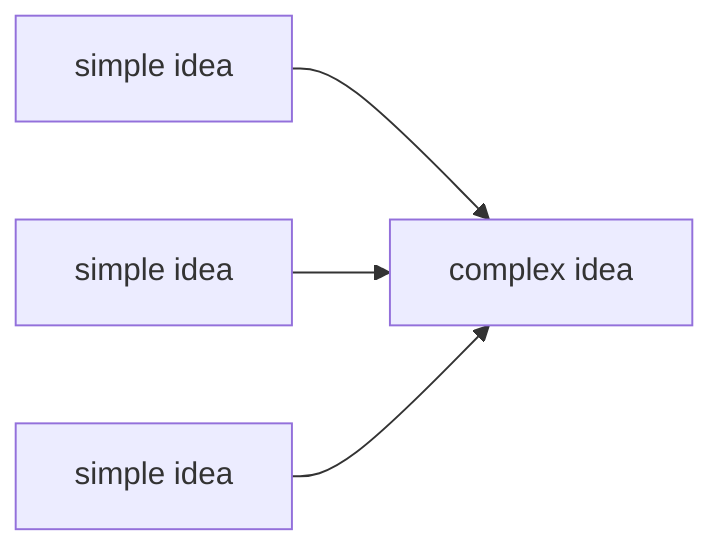
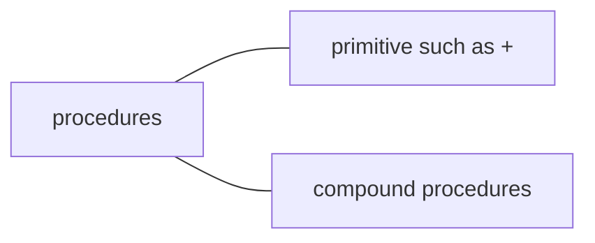
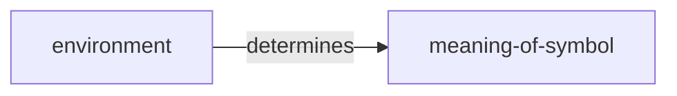
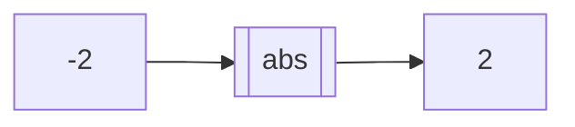
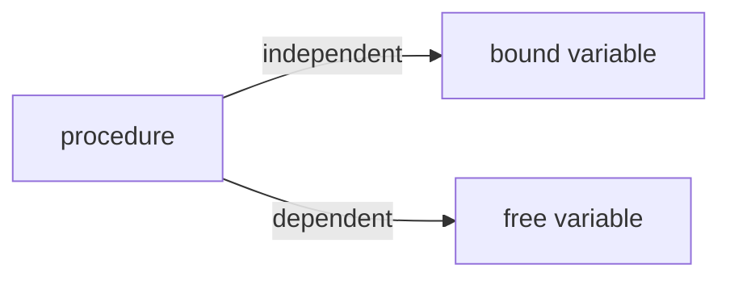
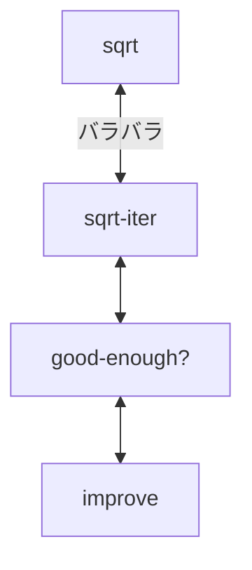
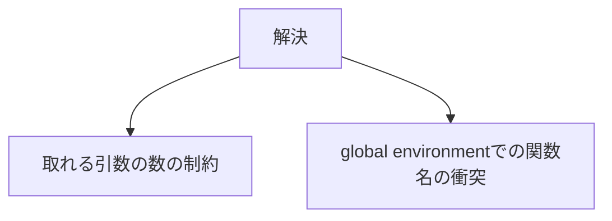

# SICP


# project

 - To understand how program works,
 - So be versatile to any programming language

By 9/1

# 1.1 Elements of programming language

### Key Ideas



 1. primitive expressions
 2. means of combination
 3. means of abstraction

The most basic elements of programming language is 'data' and 'procedure'.



### Combination
combination = procedure
How interpreter evaluates combination?

 - evaluate subexpressions of combination
 - apply operators to the arguments that are resulting values of subexpressions

次に各数値などのprimitive expressionを評価する。
実はoperatorも変数の特殊系みたいなものだと言える。

### Variable
Variable is one of abstraction ways.
It enables us to write more complex programs.
変数を使うために、memoryのどこかに記録しておく。
その場所を'global environment'という。

```scheme
(define size 2)
```

つまり複雑な問題も分解すれば、簡単になる。

### Procedure definitions
手順の複合体に名前をつけること。関数的なイメージ。

```scheme
(define (<name> <parameter>) (<body>))
```
procedure（関数）も特殊な変数のようなものらしい。
```python
max(1.2, 4)
# 4

f = max
f(1.2, 4)
# 4
#maxは一連の最大値を求める手続きを表す変数だった
```

### pure function vs non-pure function

 - pure function:
	 - 入力を受け取り値を返す以上のことはしない。

 - non-pure function:
	 - 値を返す以外に、コンピュータもしくはインタープレターに対して副効果

例えばprintは返す値が引数に関係なくNoneを返す。
```python
print(1)
# 1

a = print(1)
print(a)
# None
```

### Applicative-order evaluaion and Normal-order evaluation

How interpreter recognizes your program?

| applicative | normal |
| --- | --- |
| the arguments to procedure must be evaluated before the procedure is applied| the arguments to a procedure aren't evaluated until the values needed|

### Statemnent vs Expression
| statement | expression |
|--|--|
| be executed | be evaluated |

e.g. of statement)
def, return

returnがない関数はどのような処理がされるのか。
```python
def square(x):
	mul(x, x)
```
returnがないので、実行はされるが何も返さない。printの場合は有効。
statementが各expressionをコントロールしている。

### Conditional
```scheme
(cond (<p1> <e1>)
	  (<p2> <e2>)
	  ...
	  (<pn> <en>))
```
p: predicate. (T or F)
e: subsequent expression

 - and, or = non procedures. なぜなら式の評価途中で処理が中止され、全ての引数が見られることがないかもしれないから。
 -  not = procedures

> if vs cond

In applicative-order evaluation, cond evaluates all arguments before the procedure.
However, If firstly checks predicate and only evaluate the one side resulting expression (argument).

pythonの場合は、'header'と呼ばれるstatementがその後に続くstatementをコントロールしている。例えばwhileなど。

```python
<header>:
	<statement>
	<statement>
	   ...
```

### mathematical functions vs computer procedures

| math-function | procedure |
|--|--|
| 物事の特性 | 物事の実行方法 |
| 宣言的知識 | 命令的知識 |
| what is  | how to    |

### procedures as black-box

procedureを構成するサブ手続きをblack boxとして扱うことができる。そのためには各サブ問題のパラメータ名が局所的で他の同じ名前と関係ない状態にあるべき。

限定されている変数をbound variableという。
限定されている範囲をscopeという。
freeはboundと反対の意味を持つ。例えば'+'はfree'。



sqrtを1つにブラックボックス化することで、サブ問題を自由な状態から、限定的な状態にすることができる。block structureという。

Before block structure


After block structure
```
define sqrt
	define improve
	define good-enough?
	define sqrt-iter
```
sqrtの中に閉じ込められることで、サブ問題が局所化した。
またsqrtの引数xは内部範囲内でfree variable化しているので、サブ問題で引数としてxを明示する必要はなくなった。

## High-order function

### High-order functionの3つの機能

 1. Functions as arguments
 2. Nested definitions
 3. Functions as return values

## Functions as arguments

sumという概念の共通化をhigh-order functionは可能にする。
```python
def summation(n, term):
	total, k = 0, 1
	while k <= n:
		total = total + term(k). #termに任意の関数を当てる
		k = k + 1
	return total
```

一般的な関数とhigh-order functionの違い

ordinary function 	<--independent-->	specific numbers
high-order function	<--independent-->	specific function

<例：反復改善アルゴリズム>

```python
def improve(update, close, guess=1):
	while not close(guess):
		guess = update(guess)
	return guess
```

## Nested definitions

何が嬉しいのか？


nested definitionの場合、environmentはどのような状態になるか？

```python
def approx_sqrt(a):
    """Return approximate square root of a

    >>> assert approx_eq(sqrt(25), 5)
    >>> assert approx_eq(sqrt(4), 2)
    >>> assert approx_eq(sqrt(0), 0)
    """
    def average(x, y):
        return (x + y) / 2

    def sqrt_update(x, a):
        return average(x, a / x)

    def sqrt_close(x, a):
        return approx_eq(x * x, a)

    return improve(sqrt_update, sqrt_close, a)
```

 - 定義した関数は必ず'parent environment'を持つ（関数が呼び出された環境）。e.g. spart_updateの場合、approx_sqrt環境。
 - 呼び出された時、その関数のローカルフレームは、自身の環境とglobal environmentの2つに拡張される。

以下のような階層構造になる。

```raw
global
	improve
	sqrt
		average
		sqrt_update
		sqrt_close
```

sqrt_updateが使うことのできる環境は3つ。

 1. sqrt_update環境
 2. sqrt環境
 3. global環境

## Functions as return values

### functional composition

関数を返す関数。

e.g)
```
f(x), g(x)
|
|
new h(x) = f(g(x))
```
```python
def compose(f, g):
	def h(x):
		return f(g(x))
	return h

assert compose(square, add)(12) == square(add(12))
```

### Currying
関数を1つの引数のみを取るように定義し直すこと。

```python
def curry_pow(x):
	def h(y):
		return pow(x, y)
	return h

# 一般化
def curry2(f);
	def h(x):
		def g(y):
			return f(x, y)
		return g
	return h

# curry化を解除 h(x)(y) -> f(x, y)
def uncurry2(h):
	def f(x, y):
		return h(x)(y)
	return f

assert uncurry2(curry2(f)) == f
assert uncurry2(curry_pow(x)(y)) == pow(x, y)
```

### lambda
名前をつけづに関数の機能を実現することができる。pythonからはlambda objectとして認識されている。
return文は1つしか取れない。また代入や制御文を使用することもできない。

```
lambda <argument> : <return-expression>
```

### Function decorator
High-order functionの効果を他の関数に適用することができる。
High-order functionの引数に他の関数を入れることと同じ効果がある。

```python
def trace(f):
	def wrapped(x):
		print('f', '(', x, ')')
		return f(x)
	return wrapped

@trace  # decorator
def triple(x):
	return 3 * x
# triple -> trace(triple)
```

# 1.2 Procedures and the Processes They Generate

### Linear Recursion vs Iteration

階乗をプログラムで表現する。
$n! = {n(n-1)(n-2)...3 *2*1}$
または
$n! = n * (n-1)!$


Linear recursion process
```scheme
(define (factorial n)
	(if (= n 1)
	1
	(* n (factorial (- n 1)))))
```

linear iterative process
```scheme
(define (factorial n)
  (fact-iter 1 1 n))

(define (fact-iter product counter max-count)
  (if (> counter max-count)
      product
      (fact-iter (* counter product)
                 (+ counter 1)
                 max-count)))
```

| Linear recursion process | linear iterative process |
|--|--|
| nが1増えるにつれて記録しなければならない情報量が1増える。図にしてみると右に出張った2次関数みたいになる。 | nが1増えるにつれてループ中の処理が1つ増える。しかしnの大きさに関係なく、必要とする変数は一定。 |

**recursive 'process' ≠ recursive 'procedure'**
| process | procedure |
|--|--|
| not about syntax. how the process evolves | syntactically the procedure call itself   |

>iterative processは3つの要素で構成されている。
>固定ルール、固定された数の変数、ループ終了条件。

### Tree Recursion

Think about fibonacci numbers like
0, 1, 2, 3, 5, 8, 13, ...
$n = (n-2)(n-1)$
$$
\begin{aligned}
&F_0 = 0, \\
&F_1 = 1, \\
&F_n = F_{n-1} + F_{n-2} \quad \text{for } n > 1.
\end{aligned}
$$

To express this, most easiest way is to use tree recursion.
```scheme
(define (fib n)
  (fib-iter 1 0 n))

(define (fib-iter a b count)
  (if (= count 0)
      b
      (fib-iter (+ a b) a (- count 1))))
```
- 性質
	- 木のように下に向かって枝分かれしていく構造
	- 各節の数（計算量）は入力に対して指数的に増える
	- 深さ（メモリ消費）は入力に対して線形に増加する

linear iterative processを使うと以下のようになる。
```scheme
(define (fib n)
  (fib-iter 1 0 n))

(define (fib-iter a b count)
  (if (= count 0)
      b
      (fib-iter
            (+ a b)
            a
```
必要な変数は3つのみ。また計算量は入力nに対して線形的に増えるだけ。

### Partition problems
問題：

 - ある任意の正の整数nとする。nより小さい正の整数mの足し算でnを分割して表現する方法は何通りあるか。

解法：
nを最大mで分割する問題は以下の2つの問題に分けることができる。

 1. n - mを最大mで分割する方法の数（mを使った世界線）
 2. n を最大m - 1で分割する方法の数　（mを使わなかった世界線）

ベースケースは以下の3つ

 1. 0をmで分割する方法は1通り
 2. 負の整数をmで分割する方法は0通り
 3. nを0で分割する方法は0通り

```py
def partition(n, m):
	if n == 0:
		return 1
	elif n < 0:
		return 0
	elif m - 1 == 0:
		return 0
	else:
		return partition(n - m, m) + partition(n, m - 1)
```


### 両替問題
任意の金額を与えられた種類のコインを使って両替する方法の数を計算せよ。

(コインの種類は、50セント, 25セント, 10セント, 5 セント, 1セントとする。 )

方針；再帰的なプロセスを使う

ベースケース（最終地点）
 - 硬貨の種類 = 0なら、0通り（両替できない）
 - 金額 < 0なら、0通り
 - 金額 = 0なら、1通り（何も使わない）
最終的にはベースケースまで問題を分割していくことを目指す。

分割していく方法：
n種類の硬貨、分割する金額をaとする。
コインの種類を小さいものから順番に並べておく。
全ての両替法の数は以下の二つに分割される。
 1. 最初の種類のコインを使わない世界線
	 - 金額aを(n - 1)種類のコインで両替する方法の数
 2. 最初のコインを最低でも1枚以上使う世界線
	 - 金額(a -d)をn種類のコインを使って両替する方法の数(dはコインの額面金額)

1と2をベースケースに到達するまで適用し続けるプロセスは、tree recursionになっている。2で(a - d)となる理由は、最初の種類のコインを最低でも1枚使うことが決まっているからである。


# わからなかった問題

 [ ] 金額に対して両替の場合の数を計算する再帰プロセスを、より効率的なアルゴリズムで書く。おそらく反復プロセスではない。

 金額に対して両替の場合の数を計算する再帰プロセスを、より効率的なアルゴリズムで書く。おそらく反復プロセスではない。


## バグの見つけ方
手順

 1. オリジナルのプログラムをチェックする
 2. ツールを使い、プログラムの流れを追う
 3. プログラムにチェックポイントを入れる

## 心構え
 1. test incrementally
 2. isolate errors
 3. check your assumption
 4. consult others

### デバッグの方針

プログラムを解釈するinterpreterがどのようにプログラムをチェックしていくかを知る必要がある。ここまで、先に部分式を求めるapplicatvie-orderと必要になるまで部分式を求めないnormal-orderを学んだ。
両方の方法に共通しているのが、プログラムが「分解」されていく過程である。

デバッグツールでは、プログラムの流れを掴む助けをしてくれる。
ある式を評価している時点をレベル0として、過去に遡っていくにつれてレベルが1づつ上がるようにする。subproblem levelという。

