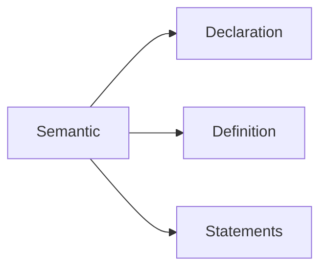
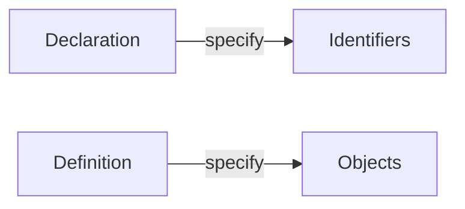

# Modern-C

## Level-1

- Syntax and semantics





- Object must have one definition
- Statements: instructions to tell what to do
- pointer: box sotres memory address of something
- `const name`: name becomes "immutable"

| Call by value                              | Call by reference                      |
|--------------------------------------------|----------------------------------------|
| functions cannot change value of arguments | functions can change argument's values |

| Signed int                                            | Unsigned int                                               |
|-------------------------------------------------------|------------------------------------------------------------|
| Contain negative integer (e.g. 0000 ~ 1111 => -8 ~ 7) | Contain only positive integer (e.g. 0000 ~ 1111 => 0 ~ 15) |

- Unsigned arithmetic has valid results except results overflow

### Values and Data

- C: can be interpreted as "abstract state machine"
- Compiler optimizes executable by removing state which is no longer used
- value: what state
- type: what this represents
- representation: how state is distinguished
- **All values are numbers**
- data is state
- type enables portability between platforms because it distinguishes values by showing what they mean
- type's binary representation: represent values of a given type on a given platform
- **The result of operations are determined by value, type and type's binary representation**
- Difference of types between integers: valid range of values (precision)
- Narrow 'integer' types (cannot use directly for arithmetic) will be signed integer before arithmetic (e.g. char, bool)
- A decimal integer constant has the first of the three signed types that fits it (e.g signed -> signed long)
- same value can have different types because of platforms they are in

#### Type determine rule

- A decimal integer constant has the first of the three signed types that fits it
  - decimal literal => signed integer and used to express negative value

```text
--->
signed char < short < int < long < long long

--->
signed int < unsigned int
```

- range of signed int in 16-bit
  - min: $2^{16} - 1$

#### literals

- 'a': integer constant
- "hello": string literals (Special version of numbers)

```c
-34
// not regarded as -1
// seen as negation operation, but can be signed
```

- **Don’t use octal or hexadecimal constants to express negative values**
  - Because - (negation) doesn't make them negative value
  - Result: $2^n - (original \space number)$

```c
1U // unsigned
1L // signed long
1ULL // unsigned long long
```

- Negation of **unsigned** integer is not like two's complement
  - $2^n - (unsigned \space integer)$ n: number of digits

```c
0.2f // floating point
0.2l // long double
0.2  // double
```