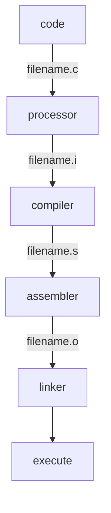
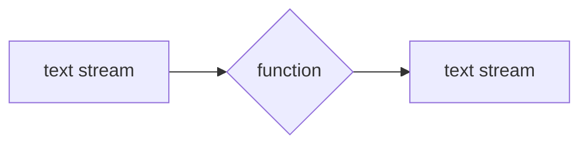
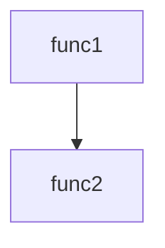

# The ANSI C
C言語についての基本を学んだ。
pythonとは違いコードをコンパイルしてから実行する。


全てのソースコードはmain関数から始まる。
```c
int main()
{

}
```
printf()はCの一部ではない。
Cには入力・出力の定義がない。

全ての変数を宣言して使う。変数の性質を告げるためである。
(datea types)
| primary   | derived   |
| :-------- | :-------- |
| int       | function  |
| float     | array     |
| char      | pointer   |
| short     | reference |
| long	    |		    |
| double    |           |


ファイルの種類に関係なくデータを扱うために、連続した文字列データとして扱う。それをtext streamと呼ぶ。行単位で構成されており、各行の最後には改行文字がくる。一文字づつ読み込む。


\nも一つの文字として扱われる。

### 文字定数
文字の内部表現に対応した文字のこと。
'A'は整数値である。
文字定数があるから、65という特定の数字を覚える必要はない。
```c
65 == 'A'
```
0 ~ 9の出現回数を10個の変数で記録するよりも、一つの配列に記録しておくほうが便利。
数値やアルファベットを検出するには、文字定数の範囲から見分ける。
'0' ~ '9'の文字定数は増加していくので、以下が成り立つ。
```c
/* [c - 48]と同じ */
ndigit[c - '0']
```


### 関数
```c
int main()
{
	return 0;
}
```
0は正常終了
0以外はエラーの終了状況


呼んだ側のfunc1の変数をfunc2は変えることはできない。

関数の構造は全て同じようになっている。
```raw
return-type function-name(declarations parameters)
{
	declarations
	statements
}
```

### 文字配列
```c
int getline(char line[], int maxline)
```
charは1byte（alphabet1文字）なのに配列ってどういうこと？
char str[x]として、最大x長の文字列を格納できる。

文字配列最後には、必ず'\0'(null)が来る。これによって文字配列の終わりがわかる。
例えば 'dragon\n'という文字は
d r a g o n \n \0

配列の中の特定の要素を削除すると、対象より後の要素全てを左シフトさせる。

文字配列において、'\0'はただの数値で特別な意味を持たない。しかし、文字列として文字配列を使う場合、'\0'は文字列の終わりを意味するので、特別な意味を持つ。

文字配列を逆にする方法。

 1. 元の配列を別の配列に後ろから要素を代入する。
 2. 元の配列を一番前と後から交換しながら真ん中まで到達する。
