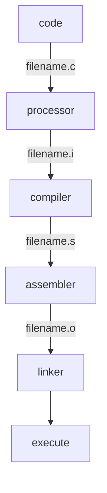
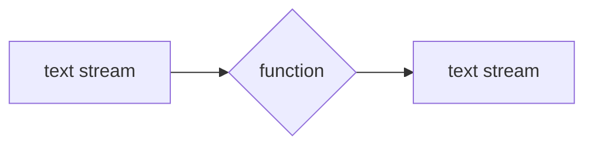

# The ANSI C
C言語についての基本を学んだ。
pythonとは違いコードをコンパイルしてから実行する。


全てのソースコードはmain関数から始まる。
```c
int main()
{

}
```
printf()はCの一部ではない。
Cには入力・出力の定義がない。

全ての変数を宣言して使う。変数の性質を告げるためである。
(datea types)
| primary   | derived   |
| :-------- | :-------- |
| int       | function  |
| float     | array     |
| char      | pointer   |
| short     | reference |
| long	    |		    |
| double    |           |


ファイルの種類に関係なくデータを扱うために、連続した文字列データとして扱う。それをtext streamと呼ぶ。行単位で構成されており、各行の最後には改行文字がくる。一文字づつ読み込む。


\nも一つの文字として扱われる。
