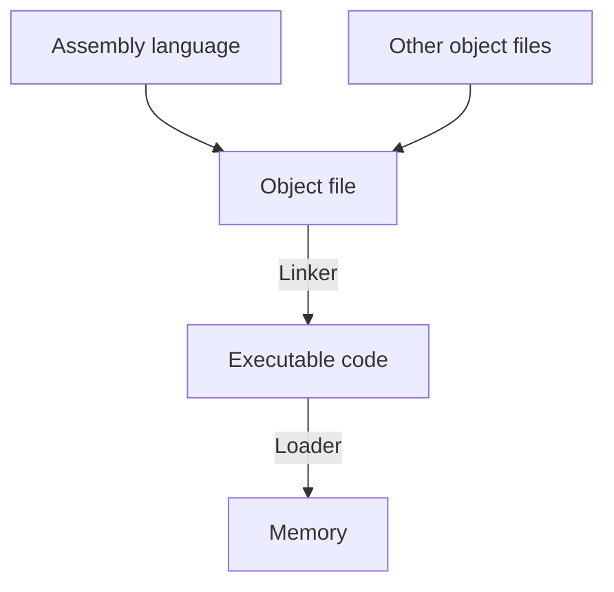

# 6 class

## Memory map

- This shows range of address for data and instuructions
- Because binary file just contains machine code

## Translation and startup



- Linker do "Linking" to merge object files
- Dynamic Linking: only link procedure when it is called

- Same ISA, Same IC
- But not same CPI because cycles per instruction can be optimmized by other factors

## ISA design

- 1 designation operand
- 2 source operands

```verilog
add a, b, c
\\ a gets b + c
```