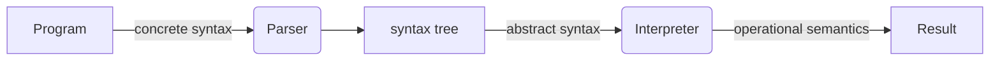

# Syntax

### How program is executed



- syntax : structure
- semantics: meaning

- Example
  - concrete syntax: which strings are valid AEs?
   - surface level
   - e.g.) precedence of operator
  - abstract syntax: What is the parsing result of each AE?
   - tree structure
   - essential structure that removes details of implementation
   - there might be multiple concrete syntax to one abstract syntax
  - operational semantics: What is the evaluation result of each  AE?

## semantic

- operational semantics
  - Define the meaning by specifing how it executes

- inference rules
  - like an valid argument
  - if premises are true, conclusion should be true

```
The expression(e) evaluates(reduces) to a number(n)
|-e => n
```

- Big-step operational semantics
  - Firstly think of final operation
  - Look left and right to check if there is still expressions that are need to be reduced
  - Do this by it just contain numbers
  - (no order)
- Small-step operational semantics
  - step-by-step reduction
  - What is next step?, ..... repeat this
  - have an order of evaluation
