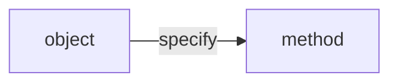

# Data abstraction

- constructor and selector

## Linked list

- a pair containing the first element of sequence and the rest of sequence
- the incremental process to find length and an element in sequence cost more time
- linked list has a recursive structure so it can be useful for constructing sequences incrementally

## Mutable data

- it is a essence of object-oriented programming
- it has identity
- Objects combine data values with behavior (both information and processes)

- Objects have attributes

```py
# expression: object
# name: attribute
<expression>.<name>
```

- Objects have methods
- Objects have methods, which are "function-valued" attributes

### Sequence objects

- lists are mutable while numbers are immutable
- In case of mutable data, methods called on one name can affect another name at the same time
- To copy listA without affecting listA by `list(listA)`
- `is`(identity) is stronger condition than `==`(equal)
- list comprehension creates new list

#### Tuple

- an immutable sequence

## Dictionaries(maps)

- **unordered** collections of key-value pairs
- restriction:
  - key cannot be a mutable value
  - max one value for a key

## Local state

- lists and dictionary (also functions) have changeable state in it
- non-local: the binding is change only in the first frame
  - only **single binding** for this variable
- python particular: all instances of a name must refer to the same frame
  - 同じ関数内で同じ名前が2つのフレームでアクセスされることを防ぐため

### Benefits of non-local assignment

- To view programs as independent objects
- Each instance of function A maintain its own non-local state, but its non-local state is inaccessible to any other functions => object abstraction!

### The cost of non-local assignment

- If you do non-local assignment, you must pay attention to a effect of change to other name that refer to same value
- Unless making new frame by a function call, assignment statements always change bindings in existing frames

## Implementing lists and dictionaries

- Use dispatch functions:
  - Different operations based on a message it receives
  - first argument: message
  - others: parameters used for behavior function

### Constraint-based system

### How to express non one-directional model like linear relationships

- Ans. Use constraints such as `adder(a, b, c)`
same as $a + b = c$
- programming language: combining constraints

## Object-oriented programming

- Type of object is called "Class"
- Identity:
  - Each object from same class has different identities

Syntax

```py
class <name>:
	<suite>
```

- `__init__(self, parameters)` is a constructor of an object from class.
- Self is bound to newly created object

Difference from message passing

- message: names local to a class
- local state values: instance attributes

```py
# same as dot expression
getattr(<expression>, <name>)
```

```py
# test if expression has attribute
hasattr(<expression>, <name>)
```

- "function" ≠ "method": To achieve automatic self passing, it distinguishes "function" and "method"

```py
Account.deposit(spock_account, 1000) # function
spock_account.deposit(1000) # method
```

### Object role

- Determines what method means.



## Class attributes v.s. Instance attributes(variables)

| Class attribute                                   | Instance attribute                                                |
|---------------------------------------------------|-------------------------------------------------------------------|
| Shared accross with all objects from a same class | Each object has an different instance attribute from a same class |

```py
# This changes attributes for all objects
<class>.<class-attribute> = 1
# This changes attribute for only one object
# (will be unaffected by above assignment)
<object>.<class-attribute> = 1
```

## Inheritance (specialization)
